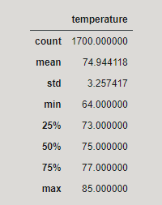
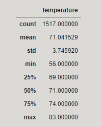

# Surfs_up

## Overview of Project
The purpose of this analysis was to use the SQLite to determine if the surf shop can remain in buisness all year round.
Main method of pulling data was through a jupyter notebook using SQLAlchemy and Pandas.  

## Results

The data has been compiled for the months of June and December below.

### *June*

### *December*

- Both months share a similar average of being in the 70°s
- Some days in December went low as 56°s
- The count was close to the same so that meant the temperature doesnt fluctuates too much.

## Summary

